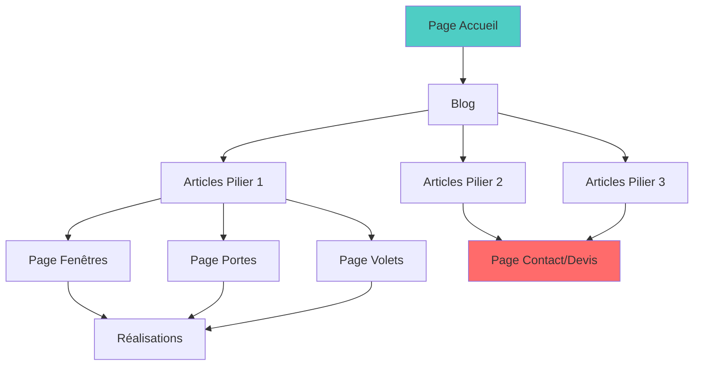

# Document de Synthèse - Référencement de segment-c.com

## Vue d'initial stratégique [Phase 1]

# Analyse SEO & Stratégie de Contenu
## Segment-C.com - Menuiserie sur Mesure

<div className="audit-header">
**Site Web** : https://www.segment-c.com/  
**Type de Page** : Landing Page Offre  
**Secteur** : Menuiserie / Rénovation  
**Zone Géographique** : Bordeaux & Gironde  
**Date d'Audit** : 26 Novembre 2025
</div>

---

## 🎯 Synthèse Exécutive

La page d'accueil de Segment-C présente une **base solide** avec un excellent focus sur le **SEO Local** et l'**optimisation pour la conversion**. La structure est professionnelle et répond bien aux intentions de recherche transactionnelles.

### Points Forts

<div className="strengths">

✅ **SEO Local excellent** - Ciblage géographique précis  
✅ **Structure hiérarchique claire** - H1, H2, H3 bien organisés  
✅ **Mots-clés sectoriels riches** - Vocabulaire métier complet  
✅ **Preuves sociales** - Témoignages clients avec photos  
✅ **CTA multiples** - Conversion optimisée  
✅ **Processus transparent** - 4 étapes rassurantes

</div>

### Axes d'Amélioration

<div className="improvements">

🔸 **Title Tag** - Optimisation mots-clés + localisation  
🔸 **H1** - Intégration dimension géographique  
🔸 **Meta Description** - Rédaction incitative au clic  
🔸 **Vitesse Mobile** - Optimisation des images  
🔸 **Maillage Interne** - Blog vers pages produits

</div>

---

## 📊 Analyse Détaillée des Éléments SEO

### 1. Structure des Titres et Mots-Clés

| Élément SEO | Constat / État Actuel | Recommandation d'Optimisation |
|-------------|----------------------|-------------------------------|
| **Title Tag** | Principalement axé sur la marque : "Segment.C" | ⚠️ **À optimiser** : Intégrer service + localisation<br/>*Exemple* : `Menuiserie sur Mesure Bordeaux - Fenêtres, Portes & Volets | Segment-C` |
| **H1 Principal** | "Votre spécialiste de confiance pour votre pose et rénovation de fenêtres sur mesure." | ✅ **Bon** mais peut être amélioré (voir section dédiée ci-dessous) |
| **Sous-titres H2/H3** | • Nos gammes de produits<br/>• Mon Processus<br/>• Mes Réalisations<br/>• FAQ<br/>• Votre menuisier de confiance en Gironde | ✅ **Excellente structure** - Hiérarchie pertinente et exhaustive |

---

### 2. Contenu et Mots-Clés Sémantiques

#### Richesse Sémantique Actuelle

```yaml
Mots-clés principaux identifiés:
  Produits:
    - Fenêtres
    - Portes
    - Volets
    - Portails
    - Baie vitrée
    - Vérandas
  
  Services:
    - Menuiserie
    - Pose
    - Rénovation
    - Sur mesure
  
  Localisation:
    - Bordeaux
    - Gironde
    - Bassin d'Arcachon
    - St Jean d'Illac
    - Mérignac
    - Pessac
```

#### Intention Utilisateur

<div className="user-intent">

**Type d'intention** : Transactionnelle (achat/demande de devis)

**Réponse du site** :
- ✅ Section Produits (gamme complète)
- ✅ Processus en 4 étapes (parcours clair)
- ✅ Réalisations (preuve sociale)
- ✅ CTA multiples (conversion facilitée)

</div>

---

### 3. SEO Local (Critique pour Artisans)

#### Ciblage Géographique

<div className="local-seo">

**Force majeure du site** : Optimisation locale exceptionnelle

**Zones géographiques couvertes** :
- 🎯 Zone principale : Gironde
- 🎯 Ville principale : Bordeaux
- 🎯 Siège : St Jean d'Illac
- 🎯 Zones secondaires : Bassin d'Arcachon, Mérignac, Pessac

</div>

#### NAP (Name, Address, Phone)

| Élément | État | Localisation |
|---------|------|--------------|
| **Nom** | ✅ Présent | Pied de page |
| **Adresse** | ✅ Complète | Pied de page |
| **Téléphone** | ✅ Visible | Pied de page + Header |

<div className="warning-box">
⚠️ **Important** : Vérifier que ces informations NAP sont **strictement identiques** sur tous les annuaires (Google Business Profile, Pages Jaunes, etc.)
</div>

---

### 4. Optimisation Conversion & Confiance (E.A.T.)

#### Éléments de Conversion

```javascript
const elementsConversion = {
  cta: {
    nombre: "Multiple (3+)",
    positions: ["Header", "Milieu de page", "Pied de page"],
    texte: "Demande de devis",
    efficacite: "⭐⭐⭐⭐⭐"
  },
  
  processusAchat: {
    etapes: 4,
    description: [
      "1. Devis gratuit",
      "2. Mesure technique",
      "3. Réalisation",
      "4. Pose professionnelle"
    ],
    impact: "Réduit les frictions et rassure"
  },
  
  preuveSociale: {
    temoignages: "Nombreux",
    contenu: "Photos + noms + emplacements",
    credibilite: "Élevée"
  },
  
  garanties: [
    "Déplacement gratuit",
    "Devis gratuit sous 48h",
    "SAV de proximité"
  ]
};
```

---

## 🔧 Optimisation du H1 (Axe d'Amélioration Prioritaire)

### H1 Actuel

<div className="current-h1">

```html
<h1>Votre spécialiste de confiance pour votre pose et rénovation de fenêtres sur mesure.</h1>
```

**Points positifs** :
- ✅ Clair et compréhensible
- ✅ Inclut "pose et rénovation"
- ✅ Mentionne "sur mesure" (différenciation)

**Points à améliorer** :
- 🔸 Absence de localisation géographique
- 🔸 Focus uniquement sur "fenêtres" (gamme plus large)

</div>

---

### Propositions de H1 Optimisés

#### Option 1 : Complet & Descriptif (RECOMMANDÉ)

```html
<h1>Pose & Rénovation de Fenêtres et Portes sur Mesure à Bordeaux et en Gironde</h1>
```

<div className="option-details">

**Avantages SEO** :
- ✅ Couvre les 2 produits principaux (fenêtres + portes)
- ✅ Intègre les services clés (pose + rénovation)
- ✅ Géolocalisation précise (Bordeaux + Gironde)
- ✅ Conserve "sur mesure" (USP)

**Longueur** : 77 caractères (optimal)  
**Mots-clés** : 6 principaux  
**Score SEO** : ⭐⭐⭐⭐⭐

</div>

---

#### Option 2 : Autorité & Certification

```html
<h1>Artisan Menuisier RGE pour vos Fenêtres, Portes & Volets sur Mesure en Gironde</h1>
```

<div className="option-details">

**Avantages SEO** :
- ✅ Valorise le statut "Artisan" (confiance)
- ✅ Mentionne certification RGE (si applicable)
- ✅ Liste 3 produits (couverture large)
- ✅ Localisation Gironde

**Longueur** : 83 caractères  
**Mots-clés** : 7 principaux  
**Score SEO** : ⭐⭐⭐⭐⭐

**Note** : À utiliser uniquement si certification RGE active

</div>

---

#### Option 3 : Court & Impactant

```html
<h1>Menuiserie sur Mesure (Fenêtres, Portes, Volets) - Votre Expert en Gironde</h1>
```

<div className="option-details">

**Avantages SEO** :
- ✅ Terme générique "Menuiserie" (large spectre)
- ✅ Liste produits entre parenthèses (scannable)
- ✅ Positionnement "Expert" (autorité)
- ✅ Localisation claire

**Longueur** : 80 caractères  
**Mots-clés** : 5 principaux  
**Score SEO** : ⭐⭐⭐⭐

</div>

---

### Comparatif des Options

| Critère | Option 1 | Option 2 | Option 3 |
|---------|----------|----------|----------|
| **Clarté** | ⭐⭐⭐⭐⭐ | ⭐⭐⭐⭐ | ⭐⭐⭐⭐⭐ |
| **SEO Local** | ⭐⭐⭐⭐⭐ | ⭐⭐⭐⭐ | ⭐⭐⭐⭐ |
| **Couverture Produits** | ⭐⭐⭐ | ⭐⭐⭐⭐⭐ | ⭐⭐⭐⭐⭐ |
| **Différenciation** | ⭐⭐⭐⭐ | ⭐⭐⭐⭐⭐ | ⭐⭐⭐⭐ |
| **Longueur** | ⭐⭐⭐⭐⭐ | ⭐⭐⭐⭐ | ⭐⭐⭐⭐⭐ |

<div className="recommendation-box">
🎯 **Recommandation Finale** : **Option 1** pour une approche équilibrée et universelle
</div>

---

## 📝 Stratégie de Contenu Éditorial (11 Articles/Semaine)

### Vue d'Ensemble de la Stratégie

<div className="content-strategy">

**Objectif** : Publication via Wisemind  
**Fréquence** : 11 articles par semaine  
**Durée minimale** : 12 semaines (pour résultats SEO)  
**Longueur cible** : 800-1500 mots/article

</div>

---

### Piliers de Contenu & Calendrier Éditorial

#### 🏗️ Pilier 1 : Guides & Conseils Pratiques (30% - 3-4 articles/semaine)

| # | Titre d'Article | Mots-clés Cibles | Intent | Priorité |
|---|-----------------|------------------|--------|----------|
| 1 | **Comment choisir ses fenêtres double vitrage à Bordeaux ?** | fenêtres double vitrage Bordeaux, isolation thermique | Info | 🔥🔥🔥 |
| 2 | **Rénovation de fenêtres : PVC, Alu ou Bois ? Guide complet 2025** | rénovation fenêtres, matériaux menuiserie | Info | 🔥🔥🔥 |
| 3 | **Installer une porte d'entrée blindée : Prix et démarches en Gironde** | porte blindée Gironde, sécurité maison | Trans | 🔥🔥 |
| 4 | **Volets roulants électriques : Avantages et coût d'installation** | volets roulants électriques, domotique | Trans | 🔥🔥 |
| 5 | **Baie vitrée sur mesure : Comment optimiser la luminosité de votre maison ?** | baie vitrée sur mesure, luminosité | Info | 🔥🔥 |
| 6 | **Isolation phonique et thermique : Le rôle crucial de vos fenêtres** | isolation fenêtres, économies énergie | Info | 🔥🔥🔥 |
| 7 | **Véranda ou pergola : Quelle extension choisir pour votre maison bordelaise ?** | véranda Bordeaux, extension maison | Info | 🔥 |
| 8 | **Entretien de menuiseries : 7 gestes essentiels pour prolonger leur durée de vie** | entretien menuiseries, conseils | Info | 🔥 |

---

#### 📍 Pilier 2 : SEO Local Hyper-Ciblé (25% - 2-3 articles/semaine)

| # | Titre d'Article | Mots-clés Cibles | Zone Géo | Priorité |
|---|-----------------|------------------|----------|----------|
| 9 | **Menuisier à Mérignac : Pose de fenêtres et portes sur mesure** | menuisier Mérignac, fenêtres Mérignac | Mérignac | 🔥🔥🔥 |
| 10 | **Rénovation de fenêtres à Pessac : Devis gratuit et pose rapide** | rénovation fenêtres Pessac, artisan Pessac | Pessac | 🔥🔥🔥 |
| 11 | **Menuiserie sur le Bassin d'Arcachon : Votre expert local** | menuiserie Bassin Arcachon, artisan bassin | Bassin | 🔥🔥 |
| 12 | **Installer une véranda à Talence : Prix, démarches et délais** | véranda Talence, extension Talence | Talence | 🔥🔥 |
| 13 | **Artisan menuisier à St Jean d'Illac : Fenêtres et portes sur mesure** | artisan St Jean d'Illac, menuiserie locale | St Jean | 🔥🔥 |
| 14 | **Pose de volets à Bordeaux Centre : Quel budget prévoir en 2025 ?** | volets Bordeaux Centre, prix volets | Bordeaux | 🔥🔥🔥 |
| 15 | **Menuiserie à Villenave-d'Ornon : Votre spécialiste de proximité** | menuisier Villenave, artisan local | Villenave | 🔥 |

---

#### 💰 Pilier 3 : Transactionnel & Pricing (20% - 2 articles/semaine)

| # | Titre d'Article | Mots-clés Cibles | Intent | Priorité |
|---|-----------------|------------------|--------|----------|
| 16 | **Prix d'une fenêtre PVC sur mesure à Bordeaux en 2025** | prix fenêtre PVC Bordeaux, tarif menuiserie | Trans | 🔥🔥🔥 |
| 17 | **Devis pose de porte d'entrée : Combien ça coûte en Gironde ?** | devis porte entrée, prix pose porte | Trans | 🔥🔥🔥 |
| 18 | **Budget rénovation menuiseries : Guide complet des prix 2025** | budget rénovation, prix menuiseries | Trans | 🔥🔥 |
| 19 | **Aides financières pour changer ses fenêtres : MaPrimeRénov' 2025** | aides fenêtres, MaPrimeRénov', RGE | Info/Trans | 🔥🔥🔥 |
| 20 | **Volets roulants solaires : Prix et économies à long terme** | volets solaires prix, économies énergie | Trans | 🔥 |
| 21 | **Comparatif : Fenêtre alu vs PVC - Prix, durabilité et esthétique** | fenêtre alu vs PVC, comparatif menuiserie | Info | 🔥🔥 |

---

#### 🏠 Pilier 4 : Réglementations & Normes (15% - 1-2 articles/semaine)

| # | Titre d'Article | Mots-clés Cibles | Intent | Priorité |
|---|-----------------|------------------|--------|----------|
| 22 | **Réglementation menuiseries 2025 : CE2020, DTU et certifications** | réglementation menuiseries, normes CE | Info | 🔥 |
| 23 | **Permis de construire pour véranda : Démarches à Bordeaux** | permis construire véranda, autorisation travaux | Info | 🔥🔥 |
| 24 | **Certification RGE menuiserie : Pourquoi c'est important pour vous ?** | certification RGE, artisan RGE | Info | 🔥🔥 |
| 25 | **Garanties menuiseries : Décennale, biennale et parfait achèvement** | garantie menuiserie, assurance travaux | Info | 🔥 |

---

#### 🎨 Pilier 5 : Tendances & Design (10% - 1 article/semaine)

| # | Titre d'Article | Mots-clés Cibles | Intent | Priorité |
|---|-----------------|------------------|--------|----------|
| 26 | **Tendances menuiseries 2025 : Couleurs et styles en vogue à Bordeaux** | tendances menuiseries, design fenêtres | Info | 🔥 |
| 27 | **Menuiseries noires : Le choix moderne pour votre maison contemporaine** | menuiseries noires, fenêtres modernes | Info | 🔥 |
| 28 | **Verrières intérieures : Comment créer de l'espace et de la lumière ?** | verrière intérieure, aménagement | Info | 🔥 |
| 29 | **Architecture basque : Adapter vos menuiseries au style régional** | menuiseries basques, style régional | Info | 🔥 |

---

## 📅 Planning de Publication (12 Semaines)

### Répartition Hebdomadaire Type

```yaml
Semaine_Type:
  Lundi:
    - 1 article Pilier 1 (Guide pratique)
    - 1 article Pilier 2 (SEO Local)
  
  Mardi:
    - 1 article Pilier 1 (Guide pratique)
    - 1 article Pilier 3 (Transactionnel)
  
  Mercredi:
    - 1 article Pilier 2 (SEO Local)
    - 1 article Pilier 1 (Guide pratique)
  
  Jeudi:
    - 1 article Pilier 3 (Transactionnel)
    - 1 article Pilier 4 (Réglementation)
  
  Vendredi:
    - 1 article Pilier 2 (SEO Local)
    - 1 article Pilier 5 (Tendances)
    - 1 article Pilier 1 (Guide pratique - Long format)

Total: 11 articles/semaine
```

---

## 🎯 Structure Type d'un Article Optimisé SEO

### Template à Suivre

```markdown
# [Titre avec Mot-clé Principal + Localisation si pertinent]

## Introduction (100-150 mots)
- Problématique du lecteur
- Annonce du plan
- Call-to-action soft (expertise locale)

## Corps de l'Article

### H2 : [Sous-section avec variation du mot-clé]
[300-400 mots]
- Paragraphes courts (3-4 lignes max)
- Listes à puces pour la lisibilité
- Inclusion de mots-clés LSI (sémantiques)

### H2 : [Question courante des clients]
[300-400 mots]
- Réponse détaillée
- Exemple concret ou chiffres
- Lien interne vers page service

### H3 : [Point spécifique]
[200 mots]

## Tableau comparatif ou Liste de prix (si applicable)

## FAQ (3-5 questions)
- Questions courantes Google
- Réponses concises (50-100 mots)

## Conclusion + CTA Fort
- Récapitulatif en 2-3 phrases
- CTA clair : "Demandez votre devis gratuit"
- Coordonnées + zone d'intervention

## Éléments techniques SEO:
- Meta Title: [60 caractères max]
- Meta Description: [150-160 caractères]
- URL: /blog/[mot-cle-principal-localisation]
- Images: Alt text descriptif + compression
- Liens internes: 2-3 vers pages services
- Liens externes: 1-2 vers sources autorité
```

---

## 📊 KPIs de Suivi de Performance

### Métriques SEO à Monitorer

```javascript
const kpisSEO = {
  trafic: {
    sessionsOrganiques: "Objectif +50% en 3 mois",
    pagesVuesTotal: "Objectif +70% en 3 mois",
    tauxRebond: "Objectif <55%"
  },
  
  positionnement: {
    motsClesTop3: "10 mots-clés en 3 mois",
    motsClesTop10: "30 mots-clés en 3 mois",
    motsClésLongueTraîne: "100+ en 6 mois"
  },
  
  conversion: {
    demandesDevis: "Objectif +40% en 3 mois",
    tauxConversionBlog: "Objectif 2-3%",
    tempsPageBlog: "Objectif >2min30"
  },
  
  local: {
    impressionsGoogleMaps: "Objectif +60%",
    clicsVersSite: "Objectif +45%",
    demandesItineraire: "Objectif +30%"
  }
};
```

---

## 🔗 Stratégie de Maillage Interne

### Architecture des Liens Internes



### Règles de Maillage

<div className="linking-rules">

1. **Chaque article du blog** doit contenir :
   - 2-3 liens vers pages services
   - 1-2 liens vers autres articles connexes
   - 1 lien vers page Contact/Devis

2. **Pages services** doivent lier vers :
   - Articles de blog pertinents (3-5 liens)
   - Page Réalisations
   - FAQ

3. **Ancres de liens** :
   - Varier les formulations
   - Utiliser des mots-clés naturels
   - Éviter "cliquez ici"

</div>

---

## 🚀 Quick Wins SEO (Actions Immédiates)

### À Faire Cette Semaine

<div className="quick-wins">

#### 1. Optimisations On-Page (2h)
- [ ] Modifier le Title Tag de l'accueil
- [ ] Rédiger une Meta Description accrocheuse
- [ ] Implémenter le nouveau H1 (Option 1 recommandée)
- [ ] Ajouter attributs Alt à toutes les images

#### 2. Google Business Profile (1h)
- [ ] Vérifier cohérence NAP
- [ ] Ajouter 10-15 photos récentes de réalisations
- [ ] Publier 1 post/semaine (actualités, conseils)
- [ ] Répondre à tous les avis (positifs et négatifs)

#### 3. Performance Technique (3h)
- [ ] Compresser toutes les images (TinyPNG)
- [ ] Implémenter lazy loading
- [ ] Activer mise en cache navigateur
- [ ] Test PageSpeed Insights (objectif >85)

#### 4. Contenu Initial (4h)
- [ ] Rédiger et publier les 3 premiers articles
- [ ] Créer calendrier éditorial 12 semaines
- [ ] Préparer templates Wisemind

</div>

---

## 📈 Résultats Attendus (Timeline)

### Projections sur 6 Mois

| Période | Trafic Organique | Positions Top 10 | Demandes Devis | Investissement Temps |
|---------|------------------|------------------|----------------|----------------------|
| **Mois 1** | +5-10% | 5-8 mots-clés | +10% | 15h/semaine |
| **Mois 2** | +15-25% | 12-18 mots-clés | +20% | 12h/semaine |
| **Mois 3** | +35-50% | 25-35 mots-clés | +35% | 10h/semaine |
| **Mois 4** | +60-80% | 40-55 mots-clés | +50% | 10h/semaine |
| **Mois 5** | +90-120% | 60-80 mots-clés | +65% | 8h/semaine |
| **Mois 6** | +130-170% | 85-110 mots-clés | +85% | 8h/semaine |

<div className="projection-note">
*Projections basées sur une publication régulière de 11 articles/semaine et une optimisation technique continue*
</div>

---

## 💡 Recommandations Supplémentaires

### Optimisations Avancées (Mois 3+)

1. **Schema Markup (Données Structurées)**
   ```json
   {
     "@context": "https://schema.org",
     "@type": "LocalBusiness",
     "name": "Segment-C",
     "image": "https://www.segment-c.com/logo.png",
     "@id": "https://www.segment-c.com",
     "url": "https://www.segment-c.com",
     "telephone": "+33XXXXXXXXX",
     "priceRange": "€€",
     "address": {
       "@type": "PostalAddress",
       "streetAddress": "Adresse complète",
       "addressLocality": "St Jean d'Illac",
       "postalCode": "33127",
       "addressCountry": "FR"
     },
     "geo": {
       "@type": "GeoCoordinates",
       "latitude": XX.XXXXX,
       "longitude": -X.XXXXX
     },
     "openingHoursSpecification": {
       "@type": "OpeningHoursSpecification",
       "dayOfWeek": ["Monday", "Tuesday", "Wednesday", "Thursday", "Friday"],
       "opens": "09:00",
       "closes": "18:00"
     },
     "sameAs": [
       "https://www.facebook.com/segmentc",
       "https://www.instagram.com/segmentc"
     ]
   }
   ```

2. **Vidéos SEO**
   - Créer 1 vidéo/mois (réalisations, conseils)
   - Héberger sur YouTube + intégrer au site
   - Optimiser titres/descriptions vidéos

3. **Link Building Local**
   - Partenariats avec architectes locaux
   - Inscription annuaires qualité (CAPEB, etc.)
   - Relations presse locale (Sud Ouest, etc.)

---

## 📞 Support & Suivi

### Contacts & Ressources

```yaml
Outils_Recommandés:
  SEO:
    - Google Search Console (suivi positions)
    - Google Analytics 4 (trafic & conversions)
    - Semrush/Ahrefs (recherche mots-clés)
  
  Rédaction:
    - Wisemind (publication automatisée)
    - Grammarly (correction)
    - Hemingway (lisibilité)
  
  Images:
    - TinyPNG (compression)
    - Canva (création visuels)
    - Unsplash (photos stock)

Fréquence_Reporting:
  - Hebdomadaire: KPIs publication (articles publiés)
  - Mensuel: Trafic, positions, conversions
  - Trimestriel: ROI global & ajustements stratégie
```

---

## ✅ Checklist de Validation Article

Avant publication, vérifier que chaque article contient :

<div className="article-checklist">

**SEO On-Page**
- [ ] Mot-clé principal dans Title (début)
- [ ] Mot-clé principal dans H1
- [ ] Mot-clé dans 1er paragraphe
- [ ] 2-3 variations dans H2/H3
- [ ] Meta Description optimisée
- [ ] URL propre et courte

**Contenu**
- [ ] 800-1500 mots minimum
- [ ] Introduction + 3-5 sections + conclusion
- [ ] 1-2 visuels optimisés (alt text)
- [ ] 2-3 liens internes
- [ ] 1 CTA clair en conclusion

**Technique**
- [ ] Images <200kb
- [ ] Responsive design testé
- [ ] Temps chargement <3sec
- [ ] Aucune erreur HTML

**Local SEO**
- [ ] Mention zone géographique (si pertinent)
- [ ] Lien vers page Contact
- [ ] Coordonnées en signature

</div>

---

## Conclusion phase 1 & Next Steps

<div className="conclusion-box">

### Feuille de Route Prioritaire

**Semaine 1** : Quick Wins SEO + Setup Wisemind  
**Semaine 2-4** : Publication 33 premiers articles (Piliers 1-2-3)  
**Mois 2** : Analyse premiers résultats + ajustements  
**Mois 3** : Intensification + schema markup  
**Mois 4-6** : Optimisation continue + link building

### Résultat Attendu

Avec une exécution rigoureuse de cette stratégie, **Segment-C.com** devrait :
- 🎯 Tripler son trafic organique en 6 mois
- 🎯 Se positionner Top 3 sur 10+ mots-clés stratégiques
- 🎯 Doubler les demandes de devis via le site
- 🎯 Devenir la référence locale en menuiserie sur Bordeaux

</div>

## Vue d'ensemble stratégique [Phase 2]

Ce document présente un plan d'action complet pour optimiser la visibilité en ligne de **segment-c.com**, entreprise du bâtiment basée dans la région de Bordeaux.

---

## 1. Préparation des informations essentielles

Avant toute inscription, rassemblez les éléments suivants :

- **Identité de l'entreprise** : Nom commercial, raison sociale
- **Coordonnées NAP** (à maintenir strictement identiques partout) :
  - Nom exact de l'entreprise
  - Adresse complète
  - Numéro de téléphone principal
- **Informations légales** : SIREN/SIRET, numéro de TVA
- **Contact** : Email professionnel, site web
- **Activité** : Description claire des services (maçonnerie, rénovation, etc.)
- **Zone d'intervention** : Bordeaux et agglomération (préciser les communes)
- **Certifications** : RGE, Qualibat, assurances professionnelles
- **Visuels** : Logo haute qualité, photos de réalisations

---

## 2. Inscriptions prioritaires dans les annuaires

### A. Annuaires professionnels et institutionnels

| Plateforme | Type | Action requise | Priorité |
|------------|------|----------------|----------|
| **Pages Jaunes** | Généraliste | Inscription via "se référencer" | ⭐⭐⭐ Haute |
| **CAPEB** | Professionnel bâtiment | Inscription annuaire artisans | ⭐⭐⭐ Haute |
| **France Rénov'** | Certification RGE | Référencement si certifié RGE | ⭐⭐⭐ Haute (si RGE) |
| **Qualibat** | Qualification bâtiment | Annuaire entreprises qualifiées | ⭐⭐ Moyenne |

### B. Plateformes de mise en relation et devis

| Plateforme | Spécificité | Intérêt |
|------------|-------------|---------|
| **Travaux.com** | Demandes de devis | Génération de prospects qualifiés |
| **RDV Artisans** | Prise de rendez-vous | Facilite le contact direct |
| **Bilik** | Artisans de confiance | Visibilité locale ciblée |
| **Bonjour Artisan** | Proximité Bordeaux | Présence locale renforcée |

---

## 3. Optimisation Google Business Profile (GBP)

<div className="highlight-box">
**Action prioritaire n°1** pour le référencement local
</div>

### Étapes de création/optimisation :

1. **Créer ou revendiquer** votre fiche d'établissement Google
2. **Renseigner exhaustivement** :
   - Catégorie principale : "Entreprise de construction" ou "Maçon"
   - Catégories secondaires pertinentes
   - Horaires d'ouverture
   - Zone de service (rayon autour de Bordeaux)
3. **Ajouter des visuels** :
   - Photos de l'équipe
   - Réalisations (avant/après)
   - Logo et photos de couverture
4. **Activer les fonctionnalités** :
   - Messages directs
   - Demandes de devis
   - Publications régulières

---

## 4. Optimisation SEO du site segment-c.com

### A. SEO On-Page

**Éléments à optimiser immédiatement** :

- **Balises Title** : Inclure "métier + Bordeaux" (ex: "Maçonnerie et rénovation à Bordeaux | Segment-C")
- **Meta descriptions** : Mentionner localisation et services spécifiques
- **Titres H1** : Un par page, avec mots-clés locaux
- **Contenu** : Intégrer naturellement "Bordeaux", "Gironde", noms de communes
- **URLs** : Structure claire avec mots-clés (ex: /maconnerie-bordeaux)

### B. SEO Technique

```yaml
Checklist technique:
  - Temps de chargement: "< 3 secondes"
  - Responsive design: "Adapté mobile"
  - Sécurité: "Certificat SSL (HTTPS)"
  - Structure: "Plan du site XML"
  - Schema markup: "LocalBusiness"
```

### C. Contenu de qualité

**Actions recommandées** :

1. **Portfolio de réalisations** : 10-15 projets avec photos et descriptions
2. **Blog professionnel** :
   - "Comment choisir son artisan maçon à Bordeaux"
   - "Rénovation de façade : réglementation à Bordeaux"
   - "Tendances construction écologique en Gironde"
3. **Page Services détaillée** par prestation
4. **FAQ** répondant aux questions courantes

---

## 5. Stratégie d'avis clients

### Plan d'action :

#### 1. Sollicitation systématique
- Demander un avis après chaque chantier réussi
- Email de suivi post-prestation
- QR code vers fiche Google sur factures/devis

#### 2. Réponse aux avis
- Remercier tous les avis positifs (personnaliser)
- Répondre professionnellement aux avis négatifs sous 48h
- Proposer des solutions en cas d'insatisfaction

#### 3. Objectif quantitatif
- Minimum 20-30 avis Google la première année
- Note moyenne visée : 4.5/5 minimum

---

## 6. Cohérence NAP (Name, Address, Phone)

<div className="warning-box">
⚠️ **CRITIQUE** pour le référencement local
</div>

- Utiliser **exactement** les mêmes informations sur toutes les plateformes
- Format identique de l'adresse (ex: "15 rue de la République" partout, pas "15 r. République")
- Même numéro de téléphone principal partout
- Vérifier et corriger les incohérences existantes

---

## 7. Planning d'exécution suggéré

### Semaine 1-2 : Fondations
- [ ] Créer/optimiser Google Business Profile
- [ ] Préparer tous les visuels et textes
- [ ] Vérifier cohérence NAP

### Semaine 3-4 : Inscriptions prioritaires
- [ ] Pages Jaunes
- [ ] CAPEB
- [ ] France Rénov' (si applicable)
- [ ] Travaux.com

### Semaine 5-6 : Inscriptions secondaires
- [ ] Qualibat
- [ ] RDV Artisans
- [ ] Bilik
- [ ] Bonjour Artisan

### Mois 2-3 : Optimisation SEO
- [ ] Audit technique du site
- [ ] Optimisation contenus existants
- [ ] Création portfolio réalisations
- [ ] Lancement blog (1 article/mois minimum)

### En continu :
- [ ] Sollicitation avis clients
- [ ] Réponse aux avis
- [ ] Publications régulières GBP
- [ ] Monitoring positions Google

---

## 8. Indicateurs de performance à suivre

**Mesures mensuelles** :

<div className="metrics-grid">

### Visibilité
- Nombre de vues Google Business Profile
- Position Google pour "maçon Bordeaux" et variantes
- Trafic site web (sessions, pages vues)

### Engagement
- Nombre d'appels/demandes de direction générés
- Taux de conversion (visiteurs → demandes de devis)
- Leads générés par plateforme

### Réputation
- Nombre total d'avis et note moyenne
- Taux de réponse aux avis
- Sentiment global des retours clients

</div>

---

## 9. Investissement estimé

**Budget indicatif** :

| Poste | Coût mensuel | Type |
|-------|--------------|------|
| Google Business Profile | Gratuit | Essentiel |
| Inscriptions annuaires de base | Gratuit | Essentiel |
| Plateformes premium | 100-300€ | Recommandé |
| Leads achetés | Variable | Optionnel | Agent IA Scrappe
| Accompagnement SEO pro | 500-1500€ | Optionnel |

---

## 10. Points de vigilance

### ⚠️ Ne jamais :

<div className="dont-list">
- ❌ Acheter de faux avis
- ❌ Dupliquer du contenu d'autres sites
- ❌ Négliger les avis négatifs
- ❌ Utiliser des informations incohérentes
</div>

### ✅ Toujours :

<div className="do-list">
- ✓ Maintenir à jour toutes les fiches
- ✓ Répondre rapidement aux demandes
- ✓ Privilégier la qualité à la quantité
- ✓ Être patient (résultats SEO sous 3-6 mois)
</div>

---

## Ressources complémentaires

### Liens utiles

```jsx
const ressources = {
  googleBusiness: "https://www.google.com/intl/fr_fr/business/",
  pagesJaunes: "https://www.pagesjaunes.fr/",
  capeb: "https://www.capeb.fr/",
  franceRenov: "https://www.france-renov.gouv.fr/",
  qualibat: "https://www.qualibat.com/",
  travaux: "https://www.travaux.com/"
};
```

### Documentation SEO locale
- Guide Google My Business
- Best practices SEO local 2025
- Réglementation avis clients

---

## Conclusion phase 2 SEO

La réussite du référencement de **segment-c.com** repose sur trois piliers :

1. **Présence cohérente** sur toutes les plateformes pertinentes
2. **Optimisation technique** et de contenu du site web
3. **Gestion active** de la réputation en ligne

En suivant ce plan d'action méthodiquement, vous pourrez significativement améliorer votre visibilité auprès de votre clientèle cible dans la région bordelaise.

---

<div className="footer-info">
**Document établi pour segment-c.com**  
*Date : Novembre 2025*  
*Révision recommandée : Tous les 3 mois*
</div>

---

## Annexes

### A. Exemple de description optimisée

```markdown
Segment-C, votre entreprise de maçonnerie et rénovation à Bordeaux

Artisan maçon qualifié basé à Bordeaux, Segment-C intervient dans toute 
la Gironde pour vos projets de construction, rénovation et extension. 
Certifié RGE, nous réalisons vos travaux de maçonnerie générale, 
façade, terrassement et aménagement extérieur avec expertise et 
professionnalisme. Devis gratuit sous 48h.

Zone d'intervention : Bordeaux, Mérignac, Pessac, Talence, Villenave 
d'Ornon et toute l'agglomération bordelaise.
```

### B. Mots-clés prioritaires

```javascript
const keywords = {
  primaires: [
    "maçon Bordeaux",
    "maçonnerie Bordeaux",
    "entreprise de maçonnerie Bordeaux",
    "artisan maçon Gironde"
  ],
  secondaires: [
    "rénovation façade Bordeaux",
    "extension maison Bordeaux",
    "terrassement Gironde",
    "travaux maçonnerie Mérignac"
  ],
  longueTraîne: [
    "entreprise maçonnerie RGE Bordeaux",
    "devis maçonnerie gratuit Bordeaux",
    "artisan maçon qualifié Pessac"
  ]
};
```

### C. Template email sollicitation avis

```markdown
Objet : Votre satisfaction nous importe - Partagez votre expérience

Bonjour [Prénom],

Nous tenons à vous remercier pour votre confiance concernant 
[type de projet] réalisé à [lieu].

Votre satisfaction est notre priorité. Si vous êtes content de notre 
intervention, nous serions ravis que vous partagiez votre expérience 
en laissant un avis sur notre page Google.

👉 Laisser un avis (2 minutes) : [LIEN]

Votre retour nous aide à nous améliorer et guide d'autres personnes 
dans leur choix.

Merci encore pour votre confiance,

L'équipe Segment-C
```

---

*Fin du document*