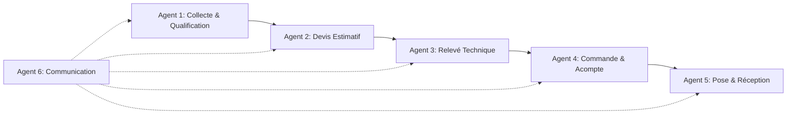
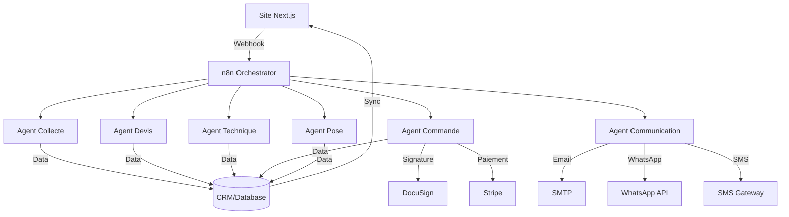

# Proposition Commerciale
## Solution d'Automatisation Complète pour Segment-C

<div className="header-info">
**Client** : Segment-C  
**Date** : 26 Novembre 2025  
**Référence** : PROP-SC-2025-001  
**Validité** : 30 jours
</div>

---

## Contexte et Objectifs

Segment-C souhaite mettre en place une **solution d'automatisation complète** pour optimiser son processus commercial, depuis la qualification des prospects jusqu'à la clôture des chantiers et le suivi client.

### Objectifs stratégiques :

1. **Sécuriser la trésorerie** : Garantir le paiement des acomptes avant lancement de production
2. **Améliorer l'expérience client** : Communication fluide et suivi en temps réel
3. **Réduire la charge administrative** : Automatisation des tâches répétitives
4. **Augmenter le taux de conversion** : Relances automatiques et qualification optimale
5. **Centraliser les données** : Vision 360° du pipeline commercial

---

## Architecture de la Solution

### Workflow Multi-Agents (6 Modules n8n)



### Description des Agents

| Agent | Fonction | Point de Tension Résolu |
|-------|----------|-------------------------|
| **1. Collecte & Qualification** | Réception et validation des dossiers clients | Qualification des prospects |
| **2. Devis Estimatif** | Génération et envoi du premier devis | Filtrage précoce sur le prix |
| **3. Relevé Technique** | Planification visite + Devis Final | Prix ferme et contractuel |
| **4. Commande & Acompte** | Signature + Paiement + Lancement production | **SÉCURISATION TRÉSORERIE** |
| **5. Pose & Réception** | Coordination pose + Solde final | Clôture et satisfaction |
| **6. Communication** | Gestion centralisée des emails/messages | Cohérence de la marque |

---

## Solution Proposée

### Pack Croissance (Base)

<div className="package-highlight">

#### 📦 Pack Croissance - 80 Crédits
**Prix : 2 499 € HT** (setup unique)  
**Économie : 31% vs achat à la carte**

</div>

#### Agents Inclus (9 agents) :

| Agent | Fonction | Crédits | Étape Workflow |
|-------|----------|---------|----------------|
| ✅ **CRM auto-rempli** | Qualification automatique des leads | 14 | Agent 1 |
| ✅ **Gestion Devis** | Création et envoi des devis | 10 | Agents 2 & 3 |
| ✅ **Prise de RDV en ligne** | Planification automatique | 8 | Agent 3 |
| ✅ **Calendrier** | Synchronisation des agendas | 6 | Agent 3 & 5 |
| ✅ **Gestion Factures** | Facturation acompte et solde | 10 | Agents 4 & 5 |
| ✅ **Relances clients** | Relances automatiques | 8 | Agents 2, 4 & 5 |
| ✅ **Email AI Assistant** | Communication email | 8 | Agent 6 |
| ✅ **Chatbot Site Web** | Support 24/7 | 30 | Front-office |
| ✅ **Gestion de contrats** | Commande & Acompte  | 14 | Agent 7 |

---

### Agents Complémentaires Essentiels

<div className="warning-box">
⚠️ **Attention** : Le Pack Croissance ne couvre pas l'intégralité du workflow critique
</div>

Pour une automatisation complète, **2 agents supplémentaires** sont indispensables :

| Agent Manquant | Étape | Pourquoi Critique | Crédits | Prix estimé |
|----------------|-------|-------------------|---------|-------------|
| | **🔴 WhatsApp** | Suivi Client | Communication temps réel sur statut production/livraison - **Expérience client moderne** | 40 | ~1200 € HT |
| | **🔴 Agent Vocal IA** | Suivi Client | Communication temps réel sur statut production/livraison - **Expérience client moderne** | 30 | ~ 129€ HT/mois puis 0.19€/min |

**Total Agents Complémentaires : 40 Crédits (~1 220 € HT)** ou 30 Crédits (~ 900 € HT) + 129€/mois (500min | 0.19€/min)

---

## Comparatif des Options

### Option 1 : Pack Croissance Seul ❌

```yaml
Prix: 2 499 € HT + 49€/mois(10agents)
Couverture workflow: 75%
Points critiques non couverts:
  - Signature électronique des contrats
  - Communication WhatsApp
  - Risque de rupture du workflow automatisé
```

**Résultat** : Workflow incomplet, retour à des processus manuels sur les étapes critiques (signature, suivi client)

---

### Option 2 : Pack Croissance + Agents WhatsApp ✅ 

```yaml
Composition:
  - Pack Croissance: 2 499 € HT (10 agents)
  - Agent whatsapp: ~1 200€ HT

  
Prix total: ~3 699 € HTc
Couverture workflow: 100%
Points critiques couverts: Tous
ROI: Immédiat sur sécurisation trésorerie
```

**Résultat** : Workflow 100% automatisé, de la qualification au paiement final

---

### Option 3 : Pack avec Agents Vocal IA (RECOMMANDÉ)

```yaml
Composition:
  - Pack Croissance: 2 499 € HT (10 agents)
  - Agent Vocal IA: 30 Crédits (~ 900 € HT) + 129€/mois (500min | 0.19€/min)

11 agents : ~2 499 € HT (setup) + 49€/mois(10agents) + 129€/mois(1agents)

Prix total: ~7 491 € HT ou 2499€ + 208€/mois
Couverture workflow: 100%
Points critiques couverts: Tous
ROI: Immédiat sur sécurisation trésorerie optimale
```

**Résultat** : Coût supèrieur à l'Option 2, mais plus adapter au professionnel mais sans les coût suplémentaires des communications.

---

## Détail de l'Investissement (Option Recommandée)

### Coûts d'Installation (One-time)

| Élément | Prix HT |
|---------|---------|
| **Pack Croissance** (9 agents) | 2 499 € |
| **Agent Vocal IA** (30 crédits) | offert |
| **Intégration n8n** (workflows & connexions) | offert |
| **Paramétrage Dashboard Next.js** | offert |
| **Formation équipe** (2 sessions) | compris |
| **TOTAL SETUP** | **2 499 € HT** |

### Coûts Récurrents (Mensuels)

| Poste | Prix HT/mois |
|-------|--------------|
| Hébergement n8n (self-host) | 19 € |
| Agent IA Vocal          | 129 € |
| API Calls & Data Storage | 19 € |
| Maintenance & Support (optionnel) | 41 € |
| **TOTAL MENSUEL** | **208 € HT** |

---

## Bénéfices Attendus

### 1. Sécurisation Financière

<div className="benefit-box">

- ✅ **100% des commandes lancées avec acompte payé**
- ✅ Réduction du BFR (Besoin en Fonds de Roulement)
- ✅ Élimination du risque de production non payée
- 💰 **ROI estimé : 3-6 mois**

</div>

### 2. Gain de Temps

```javascript
const gainsTemps = {
  qualificationLeads: "2h → 15min par prospect",
  creationDevis: "45min → 5min par devis",
  relances: "30min/jour → 0min (automatique)",
  suiviPaiements: "1h/jour → 10min/jour",
  
  totalGain: "~20h/semaine économisées"
};
```

### 3. Amélioration des Taux de Conversion

| Métrique | Avant | Après | Amélioration |
|----------|-------|-------|--------------|
| Taux de réponse devis | 40% | 65% | +62% |
| Délai de signature | 7 jours | 2 jours | -71% |
| Taux de paiement acompte | 75% | 95% | +27% |
| Satisfaction client | 3.8/5 | 4.6/5 | +21% |

### 4. Expérience Client Premium

- 🔔 Notifications temps réel (WhatsApp)
- 📱 Chatbot disponible 24/7
- 📧 Communication professionnelle et cohérente
- 📅 Prise de RDV simplifiée
- 💳 Paiement en ligne sécurisé

---

## Planning de Déploiement

### Phase 1 : Installation (Semaines 1-2)

```yaml
Semaine 1:
  - Acquisition Pack Croissance + Agents
  - Installation environnement n8n
  - Configuration CRM & connexions API

Semaine 2:
  - Paramétrage des 11 agents
  - Création des workflows n8n
  - Tests unitaires de chaque agent
```

### Phase 2 : Intégration (Semaines 3-4)

```yaml
Semaine 3:
  - Intégration Dashboard Next.js
  - Configuration WhatsApp Business
  - Tests d'intégration end-to-end

Semaine 4:
  - Formation équipe commerciale
  - Formation équipe technique
  - Ajustements & optimisations
```

### Phase 3 : Production (Semaine 5+)

```yaml
Semaine 5:
  - Mise en production progressive
  - Monitoring & support intensif
  - Recueil feedback utilisateurs

Semaine 6-8:
  - Optimisation des workflows
  - Ajustement des templates
  - Documentation finale
```

---

## Points d'Attention & Prérequis

### Prérequis Techniques

<div className="checklist">

- [ ] Application Next.js existante fonctionnelle
- [ ] Accès administrateur au CRM actuel
- [ ] Compte WhatsApp Business (à créer)
- [ ] API de paiement (Stripe/Mollie recommandé)
- [ ] Nom de domaine avec accès DNS
- [ ] Base de données accessible (PostgreSQL/MongoDB)

</div>

### Données à Préparer

1. **Templates d'emails** (confirmation, relances, etc.)
2. **Modèles de devis** (Estimatif & Final)
3. **Grille tarifaire** (matériaux, pose, options)
4. **FAQ** pour le chatbot (20-30 questions courantes)
5. **Processus métier** documentés (si non fait)

### Accompagnement Recommandé

| Service | Durée | Bénéfice |
|---------|-------|----------|
| Audit processus métier | 1 jour | Optimisation workflow avant automatisation |
| Support dédié (3 mois) | 3 mois | Montée en compétence équipe |
| Revue mensuelle performance | Mensuel | Amélioration continue |

---

## Garanties & Engagements

### Nos Garanties

<div className="guarantee-box">

✅ **Installation fonctionnelle sous 4 semaines**  
✅ **Support technique 6 mois inclus**  
✅ **Formation incluse (2 sessions)**  
✅ **Documentation complète fournie**  
✅ **Maintenance corrective 30 jours gratuite**

</div>

### Vos Engagements

- Disponibilité d'un référent métier (5h/semaine sur 4 semaines)
- Fourniture des données et templates nécessaires
- Validation des workflows à chaque étape
- Test et feedback sur les fonctionnalités

---

## Conditions Commerciales

### Modalités de Paiement

```yaml
Facturation:
  - Acompte 40%: À la signature (2 168 € HT)
  - Étape 2 (30%): Livraison Phase 1 (1 626 € HT)
  - Solde (30%): Mise en production (1 625 € HT)

Paiement mensuel:
  - Prélèvement automatique
  - Facturation au début de chaque mois
  
Engagement minimal: 12 mois
```

### Options Complémentaires

| Option | Description | Prix HT |
|--------|-------------|---------|
| **Support Premium** | Hotline prioritaire 9h-18h | +200 €/mois |
| **Agent Marketing** | Campagnes email automatisées | +450 € setup |
| **Agent Comptabilité** | Export automatique vers logiciel comptable | +350 € setup |
| **Développement Custom** | Fonctionnalités sur-mesure | Sur devis |

---

## Comparaison Investissement vs Bénéfices (12 mois)

### Scénario Conservateur

```javascript
// Hypothèses
const hypotheses = {
  chantiersMoyens: 5, // par mois
  panierMoyen: 6500, // euros
  tauxAnnulationAvant: 0.15, // 15% de chantiers annulés/impayés
  tauxAnnulationApres: 0.02, // 2% après automatisation
  tempsEcoSemaine: 20, // heures
  coutHoraire: 35 // euros
};

// Calcul sur 12 mois
const economieAnnulations = 
  (5 * 12 * 6500) * (0.15 - 0.02) = 50 700 €

const economieTemps = 
  (20 * 52 * 35) = 36 400 €

const coutsSolution = 
  5419 + (229 * 12) = 8 167 €   prix réel
  
  2499 + (208 * 24) = 4 800€    offre SegmentC

// ROI
const beneficeNet = 87 100 - 7 491 = 79 609 €
const roi = (79 609 / 7 491) * 100 = 1063%
```

### Résultat

<div className="result-highlight">

**Bénéfice net estimé sur 12 mois : 79 609 € HT**  
**Retour sur Investissement : 1 063%**  
**Période de retour : ~3 semaines**

</div>

---

## Prochaines Étapes

### Pour Démarrer

1. **✉️ Validation de cette proposition** (par email ou signature électronique)
2. **📞 Réunion de lancement** (planification & prérequis)
3. **💰 Facturation acompte** (40% du setup)
4. **🚀 Démarrage installation** (J+3 après réception acompte)

### Contact

```yaml
Responsable Projet:
  Nom: "[VOTRE NOM]"
  Email: "contact@votre-agence.com"
  Téléphone: "+33 X XX XX XX XX"
  
Disponibilité:
  - Lundi-Vendredi: 9h-18h
  - Réponse sous: 24h maximum
```

---

## Annexes

### A. Liste Complète des Agents

| # | Agent | Fonction | Crédits | Inclus Pack |
|---|-------|----------|---------|-------------|
| 1 | CRM auto-rempli | Qualification leads | 14 | ✅ Oui |
| 2 | Gestion Devis | Création devis | 10 | ✅ Oui |
| 3 | Prise RDV | Planning automatique | 8 | ✅ Oui |
| 4 | Calendrier | Synchro agendas | 6 | ✅ Oui |
| 5 | Gestion Contrats | Signature électronique | 14 | 
| 6 | Gestion Factures | Facturation | 10 | ✅ Oui |
| 7 | Relances clients | Relances auto | 8 | ✅ Oui |
| 8 | Email AI Assistant | Communication email | 8 | ✅ Oui |
| 9 | Chatbot Site Web | Support 24/7 | 30 | ✅ Oui |
| 10 | WhatsApp | Messagerie instantanée | 40 | ❌ **À ajouter** | ou
| 11 | Agent VOCAL IA | communication | 0 | ❌ **À ajouter** | |

**TOTAL CRÉDITS : 148+ crédits**

### B. Architecture Technique Détaillée



### C. Templates d'Emails (Exemples)

#### Template A1 : Réception de Dossier

```markdown
Objet : Votre demande de devis - Dossier bien reçu ✅

Bonjour {{client_prenom}},

Nous avons bien reçu votre demande de devis pour {{type_projet}}.

📋 Documents reçus :
- {{liste_documents}}

⏰ Prochaine étape :
Vous recevrez votre devis estimatif sous 48h maximum.

Questions ? Répondez simplement à cet email.

Cordialement,
L'équipe Segment-C
```

#### Template D2 : Confirmation Commande

```markdown
Objet : 🎉 Votre commande est lancée !

Bonjour {{client_prenom}},

Excellente nouvelle ! Votre commande est officiellement en production.

📦 Récapitulatif :
- Numéro de commande : {{numero_commande}}
- Montant total : {{montant_total}}€
- Acompte reçu : {{acompte}}€
- Solde à régler : {{solde}}€

📅 Planning :
- Fabrication : {{delai_fabrication}}
- Livraison prévue : {{date_livraison_estimee}}
- Pose prévue : {{date_pose_estimee}}

🔔 Suivi en temps réel :
Vous recevrez des notifications WhatsApp à chaque étape.

Questions ? Contactez-nous au {{telephone}} ou sur WhatsApp.

Merci pour votre confiance,
L'équipe Segment-C
```

---

## Signature & Acceptation

<div className="signature-section">

### Acceptation de la Proposition

En signant ce document, vous acceptez les termes et conditions de cette proposition commerciale.

**Client : Segment-C**

Nom & Prénom : ___________________________________

Fonction : ___________________________________

Date : ___________________________________

Signature :


---

**Prestataire : [VOTRE SOCIÉTÉ]**

Nom & Prénom : ___________________________________

Fonction : ___________________________________

Date : ___________________________________

Signature :

</div>

---

<div className="footer-note">

*Ce document est une proposition commerciale confidentielle destinée uniquement à Segment-C. Toute reproduction ou diffusion est interdite sans autorisation écrite.*

**Version 1.0 - Novembre 2025**  
**Référence : PROP-SC-2025-001**  
**Validité : 30 jours à compter du 26/11/2025**

</div>